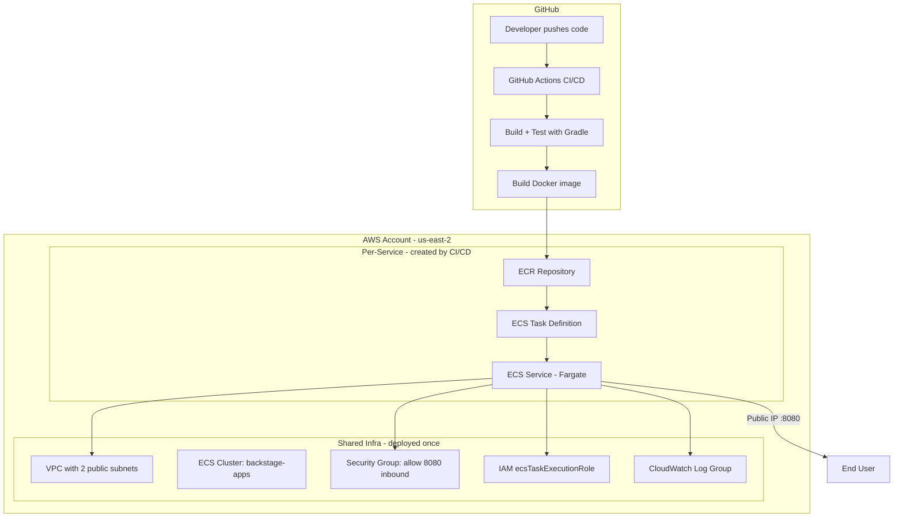

# AWS Deployment Plan for Scaffolded Spring Boot Apps

## Goal

Update the Spring Boot scaffolder template so that when a developer creates a new service, its CI/CD pipeline automatically:
1. Builds and pushes the Docker image to **AWS ECR**
2. Deploys the container to **AWS ECS Fargate**
3. The app is accessible via a public IP on port 8080

## Architecture



## Shared Infrastructure - One-time Setup

A CloudFormation template at `aws/shared-infrastructure.yml` provisions:

| Resource | Details |
|----------|---------|
| VPC | 10.0.0.0/16 CIDR |
| Public Subnet A | 10.0.1.0/24 in us-east-2a |
| Public Subnet B | 10.0.2.0/24 in us-east-2b |
| Internet Gateway | Attached to VPC |
| Route Table | 0.0.0.0/0 -> IGW |
| ECS Cluster | Named `backstage-apps` |
| Security Group | Inbound TCP 8080 from 0.0.0.0/0, all outbound |
| IAM Role | `ecsTaskExecutionRole` with ECR pull + CloudWatch logs permissions |
| CloudWatch Log Group | `/ecs/backstage-apps` |

Deploy command:
```bash
aws cloudformation deploy \
  --template-file aws/shared-infrastructure.yml \
  --stack-name backstage-shared-infra \
  --capabilities CAPABILITY_NAMED_IAM \
  --region us-east-2
```

Estimated cost: VPC and IAM are free. ECS cluster is free. CloudWatch logs minimal.

## Per-Service Resources - Created by CI/CD

Each scaffolded app's CI/CD workflow handles its own:

1. **ECR Repository** - created on first deploy if it doesn't exist
2. **ECS Task Definition** - registered from `aws/task-definition.json` in the repo
3. **ECS Service** - created on first deploy, updated on subsequent deploys

No ALB is used. Each Fargate task gets a public IP via `awsvpc` networking with `assignPublicIp: ENABLED`. This keeps costs low and infrastructure simple for a demo.

Tradeoff: public IP changes on each redeployment. For production, add an ALB. For this demo, it's acceptable.

## CI/CD Workflow Changes

The deploy job in `ci-cd.yml` changes from GHCR push to:

```
Steps:
1. Checkout code
2. Configure AWS credentials (from GitHub secrets)
3. Login to ECR
4. Build and push Docker image to ECR
5. Create ECR repo if not exists (AWS CLI)
6. Create ECS service if not exists (AWS CLI)
7. Render task definition with new image URI
8. Deploy task definition + update ECS service
9. Wait for service stability
```

Uses these official AWS GitHub Actions:
- `aws-actions/configure-aws-credentials@v4`
- `aws-actions/amazon-ecr-login@v2`
- `aws-actions/amazon-ecs-render-task-definition@v1`
- `aws-actions/amazon-ecs-deploy-task-definition@v2`

## Required GitHub Secrets

Must be set at the GitHub org level or per-repo:

| Secret | Value |
|--------|-------|
| `AWS_ACCESS_KEY_ID` | IAM user access key with ECR + ECS permissions |
| `AWS_SECRET_ACCESS_KEY` | Corresponding secret key |

These cannot be set automatically by the scaffolder. The user must either:
- Set them at the GitHub organization level (recommended - all repos inherit)
- Add them manually to each scaffolded repo

## Files to Create/Modify

### New files
- `aws/shared-infrastructure.yml` - CloudFormation for shared infra
- `examples/spring-boot-template/content/aws/task-definition.json` - ECS task definition template

### Modified files
- `examples/spring-boot-template/content/.github/workflows/ci-cd.yml` - Replace GHCR with ECR+ECS deploy
- `examples/spring-boot-template/template.yaml` - Update description
- `app-config.production.yaml` - Add spring-boot-template catalog location

## Cost Estimate

With $100 credits on the backstagefedex account:

| Service | Cost | Notes |
|---------|------|-------|
| ECS Fargate (per service) | ~$7-10/month | 0.25 vCPU, 0.5 GB RAM running 24/7 |
| ECR | ~$0.10/GB/month | Image storage |
| CloudWatch Logs | ~$0.50/GB | Log ingestion |
| VPC/Subnets | Free | No NAT Gateway needed |
| Data Transfer | First 100GB free | |

Running one service 24/7 costs roughly $8-12/month. With $100 credits, that's 8-12 months of one service, or 185 days of 2-3 services.

## Setup Steps

1. Deploy shared infrastructure CloudFormation stack to AWS
2. Create an IAM user with ECR + ECS permissions
3. Configure GitHub secrets (org level or per-repo)
4. Scaffold a new project using the template
5. Push code to main branch
6. CI/CD builds, pushes to ECR, deploys to ECS
7. Get the public IP from ECS console or CI/CD output

## Risks and Mitigations

| Risk | Mitigation |
|------|------------|
| Public IP changes on redeploy | Acceptable for demo. Add ALB for production. |
| GitHub secrets not configured | Document clearly. Recommend org-level secrets. |
| Free credits exhaustion | Use minimal Fargate sizing. Stop services when not needed. |
| Shared infra not deployed | CI/CD will fail clearly with missing cluster/subnet errors. |
